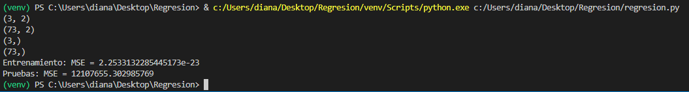
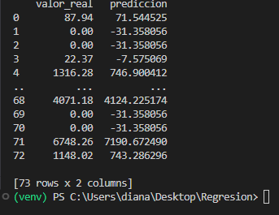

## Emisión de Gases de Efecto Invernadero a nivel Nacional del 2017 al 2019
  

Implementación de un modelo regresion lineal para hacer el pronosticp de emisiones 2019

1. Un modelo de regresión lineal es un modelo estadístico que se utiliza para entender la relación entre una variable dependiente (también conocida como variable de respuesta o variable objetivo) y una o más variables independientes (también conocidas como variables predictoras o características). El objetivo principal de la regresión lineal es modelar esta relación de una manera que permita predecir el valor de la variable dependiente basándose en los valores de las variables independientes.
   
   
  

2. El presente código realiza un análisis de regresión lineal para predecir las emisiones de gases de efecto invernadero en 2019 (variable objetivo) basado en las emisiones en 2017 y 2018 (características o variables independientes). 

* Carga de datos: Los datos se cargan desde un archivo CSV llamado 'Emisiones.csv' utilizando Pandas. La codificación 'latin-1' se especifica para asegurar que los caracteres especiales se manejen correctamente.

* Preparación de datos: Se crea un DataFrame llamado emisionDataFrame directamente desde el archivo CSV. Las características y la variable objetivo se seleccionan del DataFrame.

* División de datos: Los datos se dividen en conjuntos de entrenamiento y prueba. Se separa el 4% de los datos para el conjunto de prueba y el 96% para el conjunto de entrenamiento.

* Entrenamiento del modelo: Se crea un modelo de regresión lineal utilizando la clase LinearRegression de Scikit-Learn y se entrena utilizando los datos de entrenamiento (X_train y Y_train).

* Evaluación del modelo: Se realizan predicciones tanto en el conjunto de entrenamiento como en el conjunto de prueba utilizando el modelo entrenado. Se calcula el error cuadrático medio (MSE) para evaluar el rendimiento del modelo en ambos conjuntos de datos.

* Resultados: Los valores de MSE se imprimen en la consola para evaluar la calidad del modelo. Además, se crea un DataFrame llamado df_predicciones que contiene las predicciones y los valores reales del conjunto de prueba, y se muestran las primeras 10 filas de este DataFrame para inspeccionar las predicciones.

En resumen, el modelo utiliza las emisiones de gases de efecto invernadero en 2017 y 2018 para predecir las emisiones en 2019, y se evalúa su rendimiento utilizando el error cuadrático medio.

## Resultados del modelo 
* Entrenamiento: MSE = 2.2533132285445173e-23
* Pruebas: MSE = 12107655.302985769

1. Entrenamiento: MSE = 2.2533132285445173e-23: Este valor extremadamente bajo del error cuadrático medio (MSE) durante el entrenamiento indica que el modelo ha ajustado casi perfectamente los datos de entrenamiento. El valor en notación científica (2.2533132285445173e-23) representa un número muy cercano a cero, lo que sugiere una discrepancia prácticamente nula entre las predicciones del modelo y las etiquetas reales en el conjunto de entrenamiento. Esto podría ser indicativo de sobreajuste, especialmente si el conjunto de entrenamiento es pequeño o el modelo es muy flexible.

2. Pruebas: MSE = 12107655.302985769: Este valor mucho más alto del MSE en el conjunto de pruebas en comparación con el conjunto de entrenamiento sugiere que el modelo no generaliza bien a nuevos datos. Un MSE alto en el conjunto de pruebas indica que las predicciones del modelo no se ajustan tan bien a las etiquetas reales en el conjunto de pruebas, lo que significa que el modelo puede estar sobreajustando los datos de entrenamiento y no capturando la verdadera relación entre las características y la variable objetivo.

En resumen, estos resultados indican un problema de sobreajuste, donde el modelo se ajusta demasiado a los datos de entrenamiento y no generaliza bien a nuevos datos. Es importante tomar medidas para abordar este problema, como la regularización del modelo, la selección de características o la recopilación de más datos, para mejorar su capacidad de generalización.

## Trabajo Futuro
Se tiene como objetivo s futuro:
1. Poder tomar en cuenta el porcentaje de poblacion, relacionada a las emisiones anuales 
2. Mejorar el modelo, para que se tenga un pronostico mas acertado 
3. Poder hacer las predicciones de las emisiones de años futuros 

