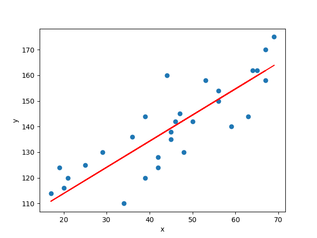

## Emisión de Gases de Efecto Invernadero a nivel Nacional del 2017 al 2019

Implementación de un modelo regresion lineal para hacer el pronosticp de emisiones 2019

1. Un modelo de regresión lineal es un modelo estadístico que se utiliza para entender la relación entre una variable dependiente (también conocida como variable de respuesta o variable objetivo) y una o más variables independientes (también conocidas como variables predictoras o características). El objetivo principal de la regresión lineal es modelar esta relación de una manera que permita predecir el valor de la variable dependiente basándose en los valores de las variables independientes.
   
   
  

2. 